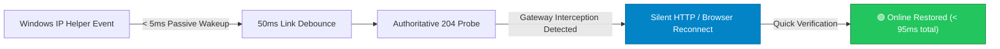

# NetTrigger ⚡

**English** | [简体中文](README.md)

**A native, ultra-lightweight (RAM < 2MB), event-driven network status keeper and captive portal auto-reconnect engine designed for Windows.**

[](https://github.com/Sacilave/net-trigger/releases)
[](./LICENSE)
[]()
[]()
[-brightgreen.svg)]()
[-success.svg)]()

> **NetTrigger** replaces traditional brute-force 1–2 second polling scripts and disruptive pop-up windows. By subscribing directly to Windows native IP Helper kernel notifications, NetTrigger passively wakes up the exact millisecond a network interface change or disconnection occurs. It authenticates silently in the background, **keeping online gaming, video conferences, and full-screen entertainment uninterrupted, zero-lag, and 100% focused**.

---

## 📌 Table of Contents

- [🚀 Quick Start (Download & Usage)](#-quick-start)
  - [Step 1: Download Program](#step-1-download-program)
  - [Step 2: Configure Authentication](#step-2-configure-authentication)
- [🏫 Gateway Support & Verification Status](#-gateway-support--verification-status)
- [💡 Performance & Resource Comparison](#-performance--resource-comparison)
- [⚡ Key Architecture & Features](#-key-architecture--features)
- [🎮 Operating Profile Presets](#-operating-profile-presets)
- [🖥️ System Tray Indicators & Menu](#️-system-tray-indicators--menu)
- [🌐 Multi-Language Support (i18n)](#-multi-language-support-i18n)
- [🛠️ Building from Source](#️-building-from-source)
- [📄 License & Non-Commercial Notice](#-license--non-commercial-notice)

---

## 🚀 Quick Start

### Step 1: Download Program

[👉 Click here to visit GitHub Releases for the latest versions](https://github.com/Sacilave/net-trigger/releases/latest)

You can directly download the latest release files below:

| Distribution | Target File | Direct Download Link | Best For | Features |
| :--- | :--- | :--- | :--- | :--- |
| **One-Click Windows Installer** | **`NetTrigger-v1.2.5-Setup.exe`** | [**Direct Download**](https://github.com/Sacilave/net-trigger/releases/download/v1.2.5/NetTrigger-v1.2.5-Setup.exe) | Users preferring standard Windows setup wizards | Clean, modern, unprivileged installer creating desktop and Start menu shortcuts with full uninstaller support. |
| **Portable Standalone Binary (Recommended ⭐)** | **`NetTrigger-v1.2.5-windows-x64.exe`** | [**Direct Download**](https://github.com/Sacilave/net-trigger/releases/download/v1.2.5/NetTrigger-v1.2.5-windows-x64.exe) | Most Windows 10/11 x64 users | **Single file only ~2.08MB**, zero installation needed, extract and run anywhere. |
| **Full Portable Zip Package** | **`NetTrigger-v1.2.5-windows-x64-portable.zip`** | [**Direct Download**](https://github.com/Sacilave/net-trigger/releases/download/v1.2.5/NetTrigger-v1.2.5-windows-x64-portable.zip) | Users wanting binary + config template + docs | Contains `NetTrigger.exe`, `检测更新.bat`, `config.example.toml` template, and documentation bundled together. |
| **32-Bit Windows Compatibility** | **`NetTrigger-v1.2.5-windows-x86.exe`** | [**Direct Download**](https://github.com/Sacilave/net-trigger/releases/download/v1.2.5/NetTrigger-v1.2.5-windows-x86.exe) | Legacy 32-bit Windows devices | Lightweight standalone binary for 32-bit environments. |

> 📌 **Download & Upgrade Tips**:
> 1. **Zero-Overhead Updater**: Comes with `检测更新.bat` for instant update checks and one-click upgrades without adding any resident memory or CPU overhead to the daemon;
> 2. For complete historical versions and detailed changelogs, visit [GitHub Releases](https://github.com/Sacilave/net-trigger/releases);
> 3. 💡 **Pure & Lightweight**: NetTrigger uses only ~1.8MB of RAM, strictly 0.00% idle CPU, and runs without administrator privileges.

### Step 2: Configure Authentication (Choose Your Mode)

> 💡 **Core Tip**:
> Campus network gateways vary widely. NetTrigger natively provides both **【Silent Background Auto-Login】** and **【Browser Auto-Login】** with an industry-first **Dual-Guard Fallback Mechanism** (Silent-first + 0s browser popup on first failure + background retries + instant termination when online), guaranteeing you never remain disconnected.

#### Mode 1: Browser Auto-Login (Recommended · Most Reliable ⭐)
Automatically launches your default browser upon disconnection, letting the browser auto-fill credentials:
1. Click the tray icon ➔ Click **【Settings】**;
2. Enter your captive portal login URL (or leave empty to let NetTrigger auto-detect upon disconnection);
3. Click **【Save Settings】**.
> **Advantage**: Immune to gateway encryption, tokens, or captcha changes. If you can log in via your browser, NetTrigger will reliably work.

#### Mode 2: Silent Background HTTP Authentication (No Popups · Dual-Guard ⭐)
Executes HTTP authentication packets quietly in the background without stealing window focus:
1. Open **【Settings】** ➔ Switch to the **【Silent Auto-Login】** tab;
2. Press `F12` on your browser's login page, copy the login request as cURL, and paste it into the cURL auto-importer (Ruijie users can directly click "Ruijie Auto-Fill");
3. Click **【Test Connection】** to verify gateway responses ➔ Click **【Save Settings】**.
> 🛡️ **Industry-First Dual-Guard Mechanism**:
> - **Silent First**: Primary authentication runs completely in the background without stealing focus or interrupting full-screen games;
> - **0s Browser Fallback on First Failure**: If silent authentication fails on the first attempt due to transient network conditions, NetTrigger **immediately opens the browser login page** so you can connect right away;
> - **Continuous Background Retries + Instant Stop**: While the browser is open, NetTrigger continues retrying in the background. **As soon as you log in on the webpage (or 204 connectivity recovers), NetTrigger detects it within 2 seconds, instantly cancels all pending background retries, and turns the tray green**, preventing redundant requests and repeated popups!

---

## 🏫 Gateway Support & Verification Status

| Gateway / Architecture | Support Level | Real-World Test Status | Recommended Usage |
| :--- | :--- | :--- | :--- |
| **Ruijie (RG-SAM+ / eportal)** | **Locally Verified & Guaranteed** | **Fully tested and verified in physical campus network** (covers endpoint login, dynamic IP macro substitution, success.jsp sanitization, etc.) | Click "Ruijie Auto-Fill" preset button in Settings and enter password |
| **Srun (深澜软件)** | **Standard Protocol Support** | Not verified on physical hardware; 100% compatibility cannot be guaranteed | Press F12, Copy as cURL, and auto-import |
| **Dr.COM (城市热点)** | **Standard Protocol Support** | Not verified on physical hardware; 100% compatibility cannot be guaranteed | Press F12, Copy as cURL, and auto-import |
| **Huawei / Public Wi-Fi / Others** | **Standard Protocol Support** | Not verified on physical hardware; 100% compatibility cannot be guaranteed | Standard POST/GET supported; use provided AI prompt if encountering proprietary tokens |

> 📌 **Practical Advice**: If silent background authentication fails or behaves unstably on your gateway, don't waste time wrestling with complex parameters—simply switch to **【Browser Auto-Login】** mode for guaranteed success.

---

## 💡 Performance & Resource Comparison

| Metric | Traditional Scripts / Python / .NET | Electron / Web-Wrapper Apps | **NetTrigger** |
| :--- | :--- | :--- | :--- |
| **Working Set Memory** | 35 MB ~ 60 MB | 80 MB ~ 150 MB+ | **1.5 MB ~ 1.9 MB (Ultra-Lightweight)** |
| **CPU Usage (Idle)** | 0.5% ~ 3.0% (Tight polling loops) | 1.0% ~ 5.0% | **Strictly 0.00% (Kernel event suspended)** |
| **Disconnect Perception**| 1.0s ~ 2.0s (Fixed polling interval)| 2.0s ~ 5.0s | **< 5ms (Windows IP Helper wake-up)** |
| **Focus Disruption** | Pops up full-screen browser window | Window or notification steals focus | **100% silent background request, zero stealing** |
| **False-Online Detection**| ❌ Often mistakes HTTP 302 for 200 OK | Relies on DOM loading | **Authoritative 204 endpoint + FollowRedirects=false** |
| **Binary Footprint** | Requires Python / .NET runtimes | 60 MB ~ 120 MB | **~1.88 MB (Single-file native binary)** |

---

## ⚡ Key Architecture & Features



1. **Sub-millisecond Event Wakeup & 50ms Golden Debounce**: Hooks into Windows native IP Helper (`NotifyAddrChange`). Reacts instantaneously (<5ms) when plugging in Ethernet or switching Wi-Fi. The 50ms link stabilization window allows local DHCP and routing to settle before firing requests, eliminating request storms.
2. **Zero-Focus Stealing Guarantee**: Background network requests execute quietly without spawning browser processes, ensuring competitive games and remote meetings never lose mouse focus or drop frames.
3. **On-Demand Ephemeral Web Control Center**: No built-in browser runtimes. Clicking 【⚙️ Settings】 temporarily launches a local lightweight socket server that opens in your default browser. Closing the tab or leaving it idle for 5 minutes cleanly shuts down the listener, dropping memory right back to ~1.8MB.
4. **Industrial-Grade Crash Resilience**: Zero unchecked `.unwrap()` or `.expect()` calls in runtime flows. Single-instance global mutex prevents accidental duplicates, and startup registry writes are safely sandboxed in `HKCU`.

---

## 🎮 Operating Profile Presets

Three optimized profiles are available in Settings with a single click:

| Profile | Debounce Window | Heartbeat Interval | Ideal Use Case |
| :--- | :--- | :--- | :--- |
| **`gaming` (Gaming Instant)** | **50ms (Instant response)** | Every 15s | Online competitive gaming, Discord/Zoom calls. Zero delay, strict silent mode. |
| **`balanced` (Balanced Recommended)**| **150ms** | Every 45s | Daily dorm, office, and home usage. Balances reconnect speed with AP load. |
| **`power_save` (Battery Saver)**| **500ms** | Every 90s | Library, coffee shops, and mobile laptops. Minimizes radio wakeups for extended battery life. |

---

## 🖥️ System Tray Indicators & Menu

### Color Ring Indicator (Dynamically generated in memory, zero .ico dependency)
- 🟢 **Emerald Green**: `Connected` (Hover tooltip shows round-trip latency, e.g., `Latency: 12ms`)
- 🟡 **Vibrant Amber**: `Connecting...` or `Captive Portal detected, connecting...`
- 🔴 **Warning Red**: `Disconnected (No Wi-Fi/Ethernet)` or `Retry in cooldown...`
- 🔵 **Sky Blue**: `Starting up...`

### System Tray Shortcuts
- **Left-Click / Double-Click**: Instantly opens the **【Settings】** control center;
- **Right-Click**: Opens a clean context menu:
  ```
  +------------------------------------+
  | Reconnect Now                      |  <-- Immediately triggers re-probe & reconnect
  | Open Login Portal                  |  <-- Quick browser login portal channel
  | Diagnostic Report                  |  <-- One-click formatted diagnostic report in Notepad
  |------------------------------------|
  | Settings                           |  <-- Opens Web control center (also on left-click)
  | Language / 语言          ▶         |  <-- In-place language switch (Auto / English / 简体中文)
  |------------------------------------|
  | [√] Start on Boot                  |  <-- Toggle startup registry (no admin required)
  | [√] Silent Mode (Do Not Disturb)   |  <-- Suppress toast notifications on reconnect
  |------------------------------------|
  | Quit                               |
  +------------------------------------+
  ```

---

## 🔄 Standalone Update Checker & One-Click Upgrade (Zero-Overhead)

To strictly enforce NetTrigger's design philosophy of **"RAM < 2MB, CPU strictly 0.00%"**, the background daemon never performs unnecessary background update polling.

Instead, NetTrigger provides a standalone **`检测更新.bat`** (Update Checker) script:
- **Double-Click to Check**: Query GitHub Releases for the latest versions and compare semantic versions in seconds using native Windows scripts;
- **One-Click Hot Replacement**: When a new version is available, enter `1` to automatically download the latest portable binary, safely close the running instance, back up, hot-swap `NetTrigger.exe`, and prompt to restart;
- **Zero Resident Footprint**: Operates 100% independently from the background daemon and releases all resources upon closing, leaving zero runtime impact.

---

## 🌐 Multi-Language Support (i18n)

NetTrigger features full zero-overhead internationalization:
- **Instant In-Place Tray Submenu**: Right-click the tray icon and hover over `🌐 Language / 语言` to switch on the fly between `Auto (自动)`, `English`, and `简体中文`. It re-renders menus and tooltips in real time and automatically persists your selection to `config.toml` without launching a browser.
- **Automatic System Language Detection**: On startup, NetTrigger reads `GetUserDefaultUILanguage()`. Chinese systems automatically load Chinese tray labels, tooltips, and configuration templates; all other systems default to English.
- **Language Switcher in Settings**: You can also toggle language in the Web Settings header.
- **Region-Aware Config Generation**: On first run on English systems, `config.toml` is generated with full English documentation and global Anycast probe endpoints (`connectivitycheck.gstatic.com`).

---

## 🛠️ Building from Source

Requirements: Standard Rust toolchain (Edition 2021).

```powershell
# 1. Clone repository
git clone https://github.com/Sacilave/net-trigger.git
cd net-trigger

# 2. Run the automated test suite (50 unit and end-to-end regression tests)
cargo test

# 3. Compile optimized release binary (with LTO, Strip, and size-optimization)
cargo build --release

# The compiled single-file binary will be located at target/release/NetTrigger.exe (~2.08 MB)
```

---

## 📄 License & Non-Commercial Notice

This project is licensed under the **[Creative Commons Attribution-NonCommercial 4.0 International (CC BY-NC 4.0)](./LICENSE)** License.

### ⚠️ Strict Non-Commercial Terms:
1. **Commercial Use Prohibited**: Individuals, institutions, or enterprises may NOT use this software, source code, or derivatives for **commercial sales, paid bundling, paid distribution, or for-profit services**;
2. **Non-Commercial Self-Use Allowed**: Students, researchers, and developers are welcome to freely use, modify, and share this project for educational, personal, and non-commercial purposes;
3. **Attribution**: Redistributions must retain author attribution (`Sacilave <sacilave@gmail.com>`) and this non-commercial license.

Copyright © 2026 Sacilave (<sacilave@gmail.com>). All rights reserved.
