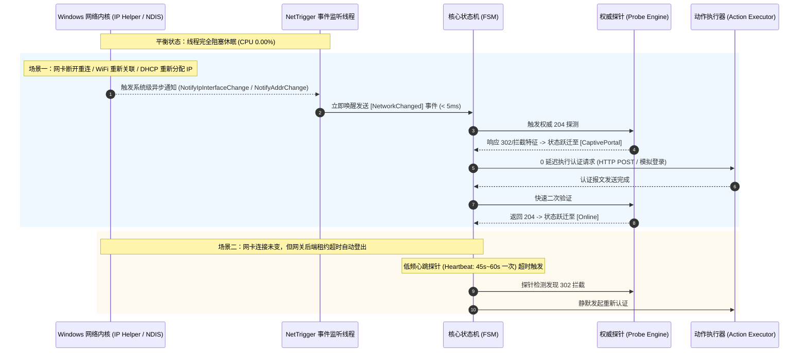

# NetTrigger 性能工程与零延迟机制设计规范

> 本文档详细阐述 NetTrigger 如何通过底层系统级事件机制、无运行时轻量架构、内存零开销设计以及编译期优化，实现**物理内存 < 2.5MB、平衡态 CPU 严格 0.00%、网络状态变动毫秒级即时响应（近乎 0 延迟）**的极致性能目标。

---

## 1. 为什么“固定短轮询”是落后的设计？

传统的自动登录小工具普遍使用 1~2 秒甚至 500ms 的死循环轮询（Polling）：
1. **高频 CPU 唤醒与电量消耗**：每秒唤醒 CPU 执行定时器调度，破坏处理器的深度 C-State 休眠，造成笔记本电池续航显著衰减。
2. **无线信道与网关负担**：不断向公共 DNS 或百度等服务器发送握手包，不仅容易被防火墙当作扫描或 Flood 攻击拦截，还会对无线局域网接入点（AP）造成持续微拥塞。
3. **“假零延迟”**：即使设置 2 秒轮询，当掉线发生在第 0.1 秒时，依然必须等待 1.9 秒才被发现，这并非真正的即时响应。

---

## 2. 真正的“0 延迟”事件驱动机制 (Event-Driven Architecture)

NetTrigger 采用**“Windows 系统级网络状态变更通知 + 低频保活心跳”**的双模驱动机制：

### 2.1 Windows 原生 API 接入实现细节
NetTrigger 挂钩 Windows IP Helper API 中的 `NotifyIpInterfaceChange` / `NotifyAddrChange`：
- 使用系统内核对象与异步重叠 I/O（Overlapped I/O）或系统事件句柄（`HANDLE`）。
- 监听线程通过 `WaitForMultipleObjects` 或 `GetOverlappedResult` 进入内核级等待。在操作系统网卡没有发生 IP、链路、路由状态改变时，**该线程完全不占用任何 CPU 周期，调度开销为 0**。
- 一旦网络状态改变，Windows 内核立即置位事件对象，线程在 **1~5 毫秒内** 完成唤醒，第一时间将网络变动事件投递至核心调度器。

---

## 3. 内存常驻与资源预算控制 (< 2.5MB)

为了保证用户在进行大型 3D 游戏或高负载渲染时，NetTrigger 在后台处于“绝对无感”的存在，系统制定了严苛的资源预算：

| 资源指标 | 预算上限 | 实现与优化策略 |
| :--- | :--- | :--- |
| **工作集内存 (Working Set)** | **<= 2.5 MB** | 摒弃一切 GC 虚拟机（.NET/Java/Go）与 Web 运行时，基于纯 Rust 原生机器码实现；静态字符串与无堆分配结构体设计。 |
| **私有提交内存 (Private Bytes)**| **<= 1.5 MB** | 禁用大缓冲区，网络探测采用紧凑的栈分配与一次性复用 Buffer。 |
| **平衡态 CPU 使用率** | **严格 0.00%** | 无轮询死循环，利用系统事件对象休眠；定时器基于 Windows Waitable Timer 机制。 |
| **可执行二进制体积** | **<= 2.0 MB** | 开启 LTO、剥离符号表（Strip）、代码体积优化（opt-level = "z"）。 |
| **磁盘 I/O** | **0 次/分（默认）** | 运行时完全驻留内存，仅在用户主动修改配置或写入显式日志时产生微小 I/O。 |

### 3.1 零拷贝与紧凑数据流
- 网络层选用极简紧凑的 HTTP 协议实现（基于同步非阻塞单套接字或轻量安全客户端），单次探测仅建立轻量级 TCP 握手并读取 HTTP Header（约 300 字节）即完成裁决，绝不下载冗余的网页正文内容。
- 托盘图标及字体资源通过 `include_bytes!` 在编译期直接固化在二进制数据段中，无需运行时向磁盘加载 `.ico` 文件，从根源消除文件句柄占用与相对路径找不到文件的错误。

---

## 4. 工业级可靠性保障体系

1. **防风暴与指数退避（Exponential Backoff with Jitter）**：
   - 当遇到网关宕机、服务器欠费停机或物理线路持续异常时，避免盲目重发造成请求风暴。
   - 重试间隔遵循公式：  
     $$T_{\text{wait}} = \min(T_{\text{max}}, T_{\text{base}} \times 2^{\text{retry}} + \text{jitter})$$
   - 达到最大退避时间后系统进入休眠挂起，直到操作系统产生新的网络连接事件（如用户重新插拔网线、重新连接 WiFi）才即刻重置计数器。
2. **单实例原子锁**：
   - 采用 Windows 命名互斥体 `CreateMutexW(NULL, TRUE, L"Global\\NetTrigger_SingleInstance_Mutex")`。
   - 若检测到实例已存在，向现有实例主窗口发送自定义消息或直接无声退出，杜绝重复运行导致的托盘图标泛滥与并发端口冲突。
3. **Panic-Free 保障**：
   - 全代码库禁止出现未受保护的 `.unwrap()` 或 `.expect()`，所有 IO、网络、注册表操作必须显式返回 `Result` 并由状态机安全降级处理。
