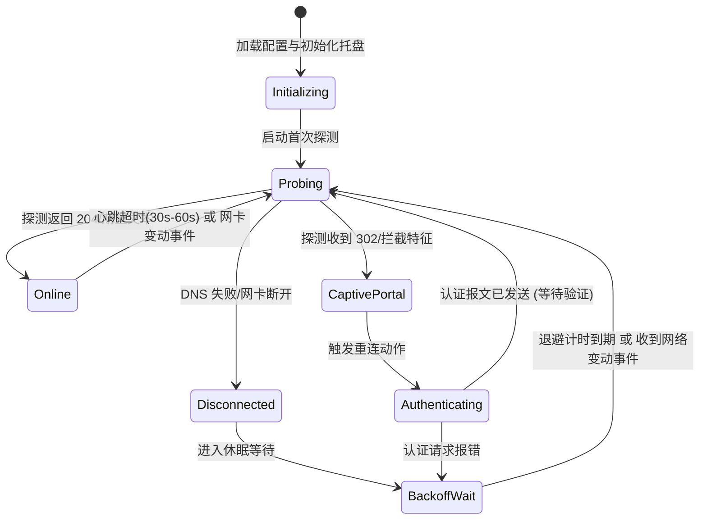

# NetTrigger 完整需求定义与系统架构设计文档

## 1. 项目背景与问题陈述

### 1.1 现状与痛点
在高校及大型园区网络环境中，校园网（Captive Portal 认证体系）通常设有基于租约时间、流量配额或空闲超时（Inactivity Timeout）的自动登出策略。这导致用户在进行日常办公、联机游戏、远程会议或后台长任务下载时，会遭遇突发性掉线。

现存的原型项目（如早期基于 WinForms / .NET Framework 4.7.2 开发的简易脚本）存在多项结构性缺陷：
1. **死锁机制**：断网重试逻辑中硬编码了 30 分钟防抖阈值，网络断开后陷入长达半小时的静默死锁。
2. **劫持识别穿透（假在线）**：采用标准 HTTP 客户端直接探测常规网页，遭遇网关 HTTP 302 重定向到认证页时误判为 HTTP 200 正常连通，导致永远无法触发重连。
3. **强行夺取桌面焦点**：所谓的“自动重连”仅仅是拉起外部浏览器全屏弹窗，粗暴打断用户前台全屏游戏和工作流，且仍需用户手动干预。
4. **资源开销严重失衡**：单纯为了托盘常驻而加载完整的 CLR 运行时和 Win32 消息循环，常驻内存高达 30MB ~ 60MB。
5. **环境依赖与路径脆弱**：基于相对路径加载资源，在开机自启或快捷方式启动时必定因工作目录改变而抛出异常崩溃。

### 1.2 项目使命
**NetTrigger** 是一款专为 Windows 平台打造的**极轻量级（RAM < 3MB、CPU 平稳 0%）、原生零依赖（单文件 exe）、基于事件驱动（近乎 0 延迟响应）的网络状态自动化触发与校园网认证守护引擎**。

---

## 2. 核心设计原则

1. **极致轻量（Ultra-Lightweight & Minimal Footprint）**：
   - 严控内存占用，运行时常驻物理内存稳定在 **1.5MB ~ 3MB** 之间。
   - 平稳监控状态下 CPU 占用严格为 **0.00%**。
   - 编译为原生机器码单文件二进制，零依赖，开箱即用。
2. **事件驱动与近乎零延迟（Event-Driven, Zero-Latency Trigger）**：
   - 告别粗暴的 2 秒固定盲轮询。深度接入 Windows 网络变更通知（IP Helper API / `NotifyAddrChange` / `NetworkInformation.NetworkAddressChanged`），在网卡状态变更或网关跳变的毫秒级瞬间被动唤醒。
   - 心跳保活探测作为底线防线（低频 30s ~ 60s），网络正常时绝不浪费无线信道带宽与系统功耗。
3. **无感静默（Zero-Distraction & Silent Auth）**：
   - 首要执行链路为后台直接模拟 HTTP POST/GET 完成网络认证，毫秒级连通，打游戏不弹窗、不切屏、不掉帧。
   - 提供优雅的 Fallback 兜底机制：若未配置认证凭据，支持自动唤醒浏览器。
4. **绝对可靠与工业级容错（Ironclad Reliability）**：
   - 精准区分三种物理/逻辑网络状态：**真正连通 (Online)**、**处于认证重定向拦截 (Captive Portal)**、**物理链路断开 (Disconnected)**。
   - 严密的退避重试状态机（Exponential Backoff），防止机房故障或网络闪断导致的请求风暴。
   - 绝对路径隔离与自愈能力，任何网络异常均在状态机内被安全消化，严禁进程崩溃。

---

## 3. 功能需求规格

### 3.1 核心功能特性

| 编号 | 功能项 | 详细描述 | 优先级 |
| :--- | :--- | :--- | :--- |
| **F-01** | **Captive Portal 权威探测** | 通过向标准 204 端点（如 `connect.rom.miui.com/generate_204` 或微软 NCSI `connecttest.txt`）发起请求，显式禁用 HTTP 重定向（FollowRedirects = false），依据返回状态码（204/200 或 302/307）精准裁决网络状态。 | P0 (核心) |
| **F-02** | **静默 HTTP 模拟登录** | 读取配置文件中的目标认证接口 URL、请求方法（POST/GET）、参数载荷（用户名、密码、运营商后缀），在后台静默发起认证，不产生任何桌面弹窗。 | P0 (核心) |
| **F-03** | **事件驱动即时感知** | 监听 Windows 网络层状态变更事件，当检测到网络连接断开或重新获取 IP 时，立即（< 50ms）触发状态机重判，无需等待定时周期。 | P0 (核心) |
| **F-04** | **退避重试与熔断机制** | 认证失败时启动退避重试（例如 1s -> 3s -> 5s -> 15s），连续多次失败后进入防风暴冷却状态，待网络拓扑变化时自动复位。 | P1 (重要) |
| **F-05** | **轻量系统托盘交互** | 提供 Windows 托盘图标及上下文菜单，实时视觉反馈三种状态（🟢在线、🟡重连中、🔴离线/未认证），支持菜单操作：手动重连、打开登录页、修改配置、自启动开关、退出。 | P1 (重要) |
| **F-06** | **开机自启动管理** | 提供一键切换开机自启动功能，安全写入 Windows 用户级注册表 `HKCU\Software\Microsoft\Windows\CurrentVersion\Run`，无需管理员 UAC 提权，且启动时自动锁定自身绝对路径。 | P1 (重要) |
| **F-07** | **灵活动作触发器（Action Pipeline）** | 不仅支持 HTTP 模拟登录，还支持触发执行任意系统脚本/命令（如唤起浏览器、刷新 DNS、打印日志）。 | P2 (扩展) |

### 3.2 非功能需求

- **目标平台**：Windows 10 / 11 (x86_64, aarch64)。
- **单文件大小**：优化编译及剥离符号后二进制体积 < 3MB。
- **内存占用**：运行时 Working Set 内存常驻 <= 3MB。
- **启动时间**：从启动到托盘渲染完成 < 50ms。
- **并发与安全**：线程安全的状态机，无内存泄漏，零未捕获 panic。

---

## 4. 系统架构与模块设计

```mermaid
graph TD
    subgraph NetTrigger Runtime
        Config[配置子系统 (Config Manager)<br/>config.toml] --> Engine
        
        subgraph Engine[核心引擎 (Engine Core)]
            FSM[状态机 (State Machine)]
            Watcher[Windows 适配器事件监听器 (Adapter Watcher)] -->|网络事件唤醒| FSM
            Ticker[低频保活心跳 (Heartbeat Ticker)] -->|周期探针| FSM
            Probe[Captive Portal 权威探测器 (Portal Probe)] <--> FSM
            Scheduler[退避调度器 (Backoff Scheduler)] <--> FSM
        end
        
        subgraph Action[动作执行系统 (Action Executor)]
            HttpAuth[静默认证器 (HTTP Auth Client)]
            CommandRun[系统命令/浏览器调用器]
        end
        
        FSM -->|触发重连动作| Action
        
        subgraph UI[界面与交互 (UI & Tray)]
            Tray[系统托盘 (System Tray)]
            Menu[上下文菜单 (Context Menu)]
            AutoStart[注册表自启管理 (Auto-Start Registry)]
        end
        
        FSM -->|状态同步| Tray
        Menu -->|用户控制指令| FSM
        Menu -->|自启配置| AutoStart
    end
```

### 4.1 核心状态机设计（State Machine）

系统采用明确有限状态机（FSM）驱动整个生命周期：



### 4.2 Captive Portal 权威判定算法

为彻底根除“假连通”和“劫持穿透”，探测客户端配置如下策略：
1. **禁用自动重定向**：`FollowRedirects = false`。
2. **主探测端点**：`http://connect.rom.miui.com/generate_204`（国内节点全覆盖，极速响应）。
3. **备用探测端点**：`http://www.msftconnecttest.com/connecttest.txt`（Windows NCSI 官方端点）。
4. **状态裁决矩阵**：
   - HTTP 状态码为 `204 No Content`（或探测端点返回严格匹配的已知文本）：**明确判定为 Online（互联网完全畅通）**。
   - HTTP 状态码为 `302 / 301 / 307` 且响应头 `Location` 指向局域网 IP（或包含 login/portal）：**明确判定为 CaptivePortal（校园网拦截）**。
   - HTTP 状态码为 `200 OK` 但响应体并非预期内容而是校园网认证 HTML：**明确判定为 CaptivePortal**。
   - 底层 TCP 握手失败、DNS 解析超时或路由不可达：**判定为 Disconnected（网络硬件或链路离线）**。

### 4.3 两级认证执行链路（Two-Tier Auth Pipeline）

1. **Tier-1 静默认证**：
   - 发送经过模板替换后的 HTTP POST/GET 请求。
   - 支持 URL 编码表单（`application/x-www-form-urlencoded`）与 JSON。
   - 携带自定义 User-Agent 及必要的校园网特定 Header。
2. **Tier-2 浏览器兜底（Fallback）**：
   - 当配置文件中将 `mode` 设为 `browser` 或静默认证持续多次失败时，通过 Win32 API `ShellExecuteW` 静默以用户默认浏览器唤起配置的登录网页。

---

## 5. 配置规范 (`config.toml`)

```toml
# NetTrigger 核心配置规范

[general]
# 托盘展示应用名称
app_name = "NetTrigger"
# 正常在线时的心跳探测间隔 (秒)
heartbeat_interval_sec = 45
# 探测超时时间 (毫秒)
probe_timeout_ms = 3000
# 启用 Windows 网络接口变更即时监听 (0 延迟响应)
enable_network_watcher = true
# 失败重试最大退避时间 (秒)
max_backoff_sec = 60

[probe]
# 探测端点 (优先使用返回 204 的高速端点)
primary_url = "http://connect.rom.miui.com/generate_204"
fallback_url = "http://www.msftconnecttest.com/connecttest.txt"
fallback_expected_body = "Microsoft Connect Test"

[auth]
# 动作模式: "http" (静默模拟登录) 或 "browser" (唤起浏览器)
mode = "http"
# 校园网登录页面 URL (用于浏览器打开或 Referer)
portal_url = "http://10.10.200.102/"

# 仅当 mode = "http" 时生效的认证配置
[auth.http]
method = "POST"
action_url = "http://10.10.200.102/drcom/login"
# 表单参数 (支持宏替换: {username}, {password})
[auth.http.params]
DDDDD = "your_student_id"
upass = "your_password"
0MKKey = "123456"

[auth.http.headers]
User-Agent = "Mozilla/5.0 (Windows NT 10.0; Win64; x64) AppleWebKit/537.36"
Content-Type = "application/x-www-form-urlencoded"
```

---

## 6. 安全性与可靠性考量

1. **绝对路径安全**：
   - 程序启动时强制通过 `std::env::current_exe()` 获取可执行文件宿主目录，所有配置文件、日志、图标资源均以此基准路径为根，免疫开机自启工作目录偏移问题。
2. **单实例互斥保护**：
   - 启动时通过 Windows 原生互斥体 `CreateMutexW(NULL, TRUE, L"Global\\NetTrigger_SingleInstance_Mutex")` 确保全局仅运行单个守护进程实例，重复双击时仅唤起现有实例或静默退出。
3. **退避防风暴（Anti-Storm & Backoff）**：
   - 在校园网服务器宕机或欠费停机时，程序绝不进行高频重试，指数增长重试延迟（1s, 2s, 4s, 8s, 16s, 32s, 60s），并在达到上限后进入挂起状态，直到 Windows 产生网络适配器事件才重置。
